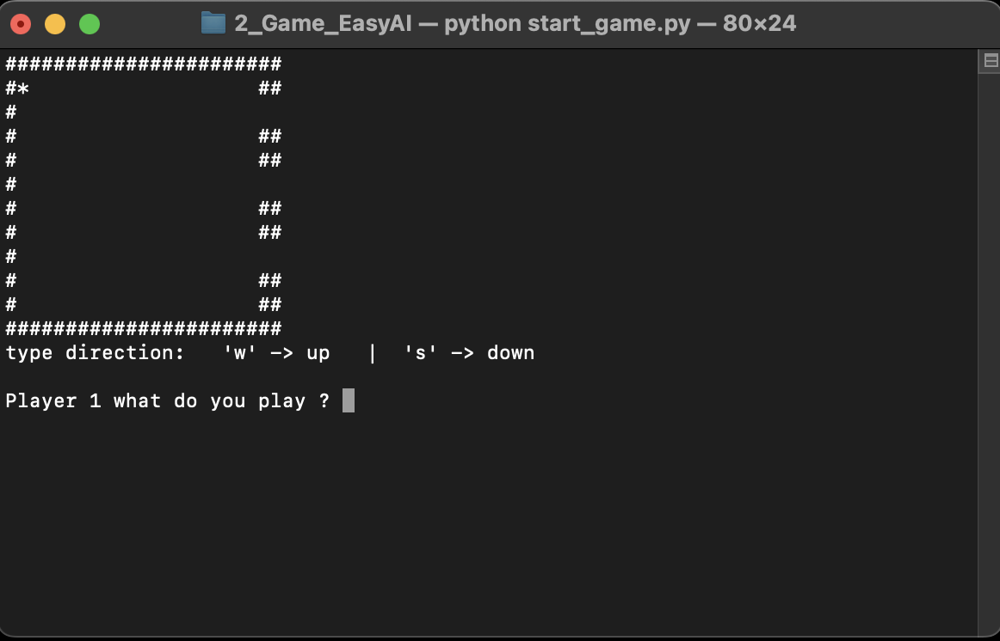
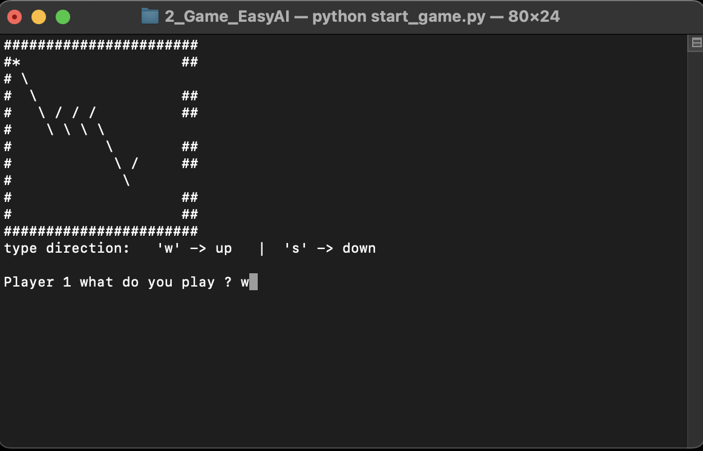
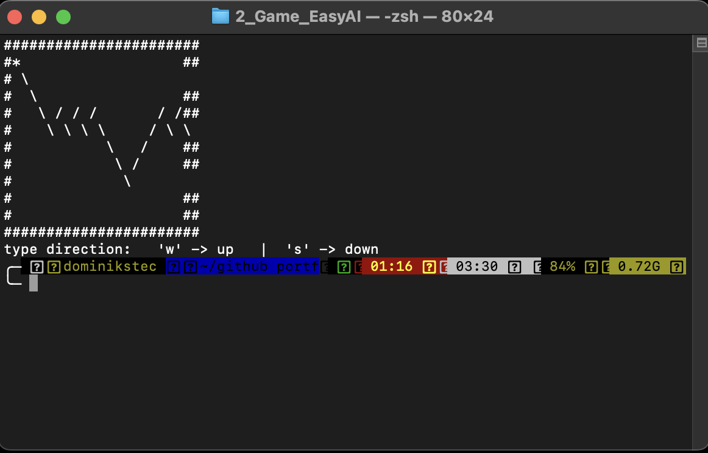
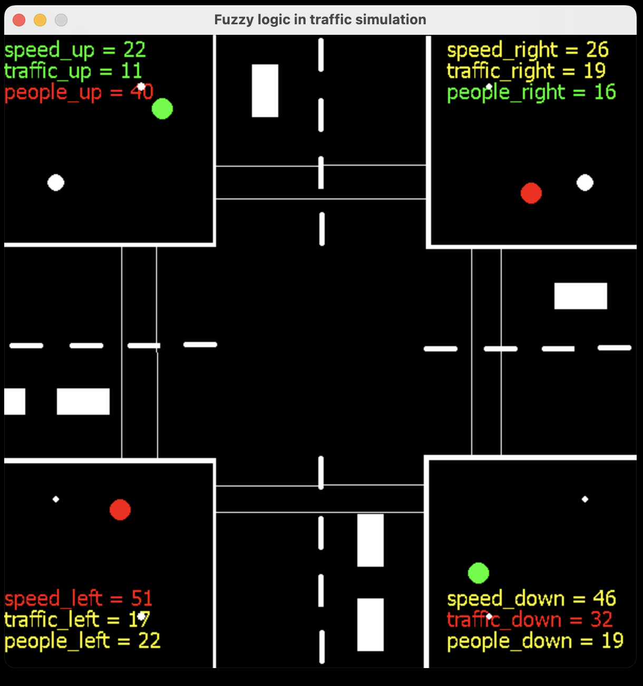
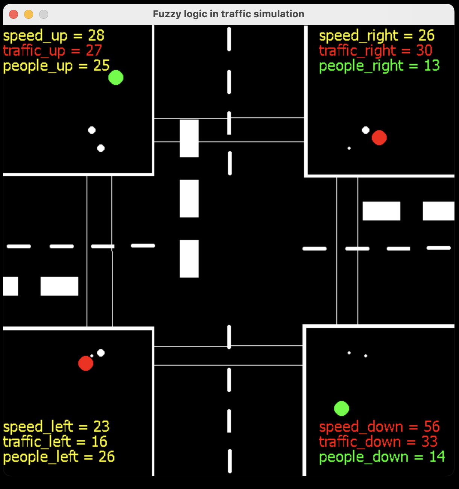
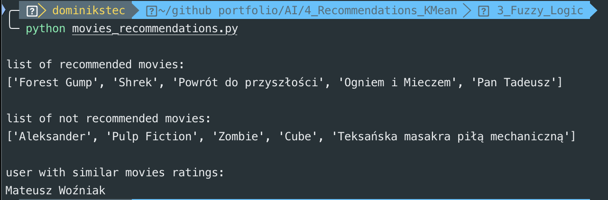
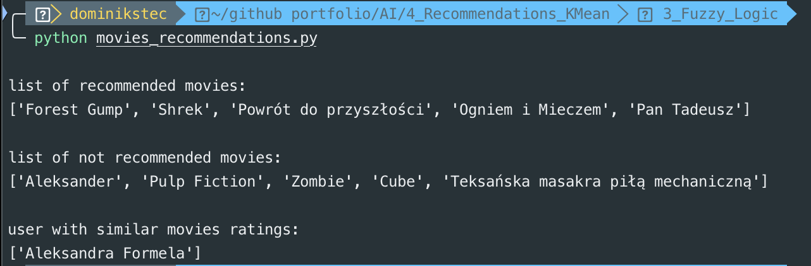

<!--
*** Thanks for checking out c. If you have a suggestion
*** that would make this better, please fork the repo and create a pull request
*** or simply open an issue with the tag "enhancement".
*** Thanks again! Now go create something AMAZING! :D
-->

<!-- PROJECT SHIELDS -->
<!--
*** I'm using markdown "reference style" links for readability.
*** Reference links are enclosed in brackets [ ] instead of parentheses ( ).
*** See the bottom of this document for the declaration of the reference variables
*** for contributors-url, forks-url, etc. This is an optional, concise syntax you may use.
*** https://www.markdownguide.org/basic-syntax/#reference-style-links
-->

[![Contributors][contributors-shield]][contributors-url]
[![Forks][forks-shield]][forks-url]
[![Stargazers][stars-shield]][stars-url]
[![Issues][issues-shield]][issues-url]
[![LinkedIn][linkedin-shield]][linkedin-url]
[![NO LICENSE][license-shield]][license-url]

<!-- PROJECT LOGO -->
<br />
<p align="center">
  <a href="https://gdansk.pja.edu.pl/pl/">
    
  </a>

  <h2 align="center">Artificial Intelligence</h2>

<p align="center">
    <h3>  Projects implement various types of artificial intelligence frameworks and libraries
 </h3>
    <!-- <br />
    <a href="https://github.com/dccstcc/GRK_PJATK_practice"><strong>» go to CODE »</strong></a>
    <br />
    <br />  -->
    <!-- <a href="https://github.com/othneildrew/Best-README-Template">View Demo</a>
    ·
    <a href="https://github.com/othneildrew/Best-README-Template/issues">Report Bug</a>
    ·
    <a href="https://github.com/othneildrew/Best-README-Template/issues">Request Feature</a> -->
  </p>
</p>

<!-- TABLE OF CONTENTS -->
<details open="open">
  <summary>Table of Contents</summary>
  <ol>
    <li>
      <a href="#project-description">Project description</a>
      <ul>
        <li><a href="#libraries-and-frameworks">Libraries / Frameworks</a></li>
      </ul>
    </li>
    <li>
      <a href="#native-deploy">Native deploy</a>
      <ul>
        <li><a href="#prerequisites">Prerequisites</a></li>
        <li><a href="#installation">Installation</a></li>
      </ul>
    </li>
    <li><a href="#how-to-use">How to use ?</a></li>
    <!-- <li><a href="#roadmap">Roadmap</a></li>
    <li><a href="#contributing">Contributing</a></li> -->
    <li><a href="#license">License</a></li>
    <li><a href="#contact">Contact with me</a></li>
    <!-- <li><a href="#acknowledgements">Acknowledgements</a></li> -->
  </ol>
</details>

<!-- ABOUT THE PROJECT -->

## Project description

<b>`Laboratory 1:`</b><br><br>
Web service for pragrammers - codingame.com<br>

<b>`Laboratory 2:`</b><br><br>
Traveller game in EasyAI.<br>

<b>`Laboratory 3:`</b><br><br>
Fuzzy logic for traffic simulation.<br>

<b>`Laboratory 4:`</b><br><br>
KMeans algorithm with metric calculations for movies recommendations system.<br>

<b>`Laboratory 5:`</b><br><br>
Support Vector Machine algorithm for classification group of Pima Indians diabetes.<br><br>
Support Vector Machine algorithm for predict heart attack risk with data generator.<br>

<b>`Laboratory 6:`</b><br><br>
Neural Networks with Tensorflow Keras library for classification and regression models in Google Colaboratory environment.<br><br>
Classification of Pima Indians diabetes.<br><br>
Classification of animals into color images.<br><br>
Classification of clothes into greyscale images.<br><br>
Regression calculation of houses price.<br>

<b>`Laboratory 7:`</b><br><br>
OpenAI Gym library for simulation the Atari game Breakout.

<b>`Laboratory 8:`</b><br><br>
RNN with LSTM layers for generate text in given style, depends on data used for fitting neural network.

### Libraries and frameworks

This project use technology below.

- [![python][python-shield]][python-url]
- [![jupyter][jupyter-shield]][jupyter-url]
- [![keras][keras-shield]][keras-url]
- [![anaconda][anaconda-shield]][anaconda-url]

<!-- GETTING STARTED -->

## Native deploy

This is instructions on setting up this project locally.

### Prerequisites

Python interpreter is need. <br/>
Jupyter Notebook or Google Collaboratory is need. <br/>
PIP python package menager is need. <br/>

### Installation

1. Clone the repo
   ```sh
   git clone https://github.com/dominik-stec/Artificial_Intelligence_PJA.git
   ```
2. Install Anaconda<br>

platform for develop and deploy python solution <br>
`https://www.anaconda.com/`
<br/>

3. Install required frameworks and libraries with python PIP manager into isolated virtual environment
   <br/>

   ```sh
    cd Artificial_Intelligence_PJA
    python -m venv ./
    source ./bin/activate
    pip install scikit-fuzzy matplotlib pygame pandas scikit-learn xlrd
   ```

   <br/>

4. Run Anacodna <br> and create new environment <br> after that run environment <br> and in terminal type: <br>

```sh
conda install -c auto easyai
```

  <br/>
5. Install required frameworks and libraries with Anaconda GUI
  <br/>

<!-- USAGE EXAMPLES -->

## How to use

<b>2_Game_EasyAI</b>

```sh
python start_game.py
```

use 'w' or 's' to move up or down





<br />

<b>3_Fuzzy_Logic</b>

```sh
python fuzzy_logic.py
```

Fuzzy logic with traffic simulation




<br />

<b>4_Recommendations_KMeans</b>

```sh
python movies_recommendations.py
```

System recommendations for movies watchers with KMeans




<br />

<!-- _For more examples, please refer to the [Documentation](https://example.com)_ -->

<!-- ROADMAP
## Roadmap

See the [open issues](https://github.com/othneildrew/Best-README-Template/issues) for a list of proposed features (and known issues).

-->

<!-- CONTRIBUTING
## Contributing

Contributions are what make the open source community such an amazing place to learn, inspire, and create. Any contributions you make are **greatly appreciated**.

1. Fork the Project
2. Create your Feature Branch (`git checkout -b feature/AmazingFeature`)
3. Commit your Changes (`git commit -m 'Add some AmazingFeature'`)
4. Push to the Branch (`git push origin feature/AmazingFeature`)
5. Open a Pull Request

-->

<!-- LICENSE -->

## License

This project has not a license.
All rights are reserved and it is not Open Source or free. You cannot modify or redistribute this code without explicit permission from the copyright holder, because projects which I realised are private conception from PJATK studies.
See `LICENSE` for more information.

<!-- CONTACT -->

## Contact

Dominik Stec - dominikstec@devapp.tools

[![LinkedIn][linkedin-shield]][linkedin-url]

Project URL:
<br />
`https://github.com/dominik-stec/Artificial_Intelligence_PJA.git`

<!-- ACKNOWLEDGEMENTS
## Acknowledgements
* [GitHub Emoji Cheat Sheet](https://www.webpagefx.com/tools/emoji-cheat-sheet)
* [Img Shields](https://shields.io)
* [Choose an Open Source License](https://choosealicense.com)
* [GitHub Pages](https://pages.github.com)
* [Animate.css](https://daneden.github.io/animate.css)
* [Loaders.css](https://connoratherton.com/loaders)
* [Slick Carousel](https://kenwheeler.github.io/slick)
* [Smooth Scroll](https://github.com/cferdinandi/smooth-scroll)
* [Sticky Kit](http://leafo.net/sticky-kit)
* [JVectorMap](http://jvectormap.com)
* [Font Awesome](https://fontawesome.com)

-->

<!-- MARKDOWN LINKS & IMAGES -->
<!-- https://www.markdownguide.org/basic-syntax/#reference-style-links -->

[contributors-shield]: https://img.shields.io/github/contributors/dominik-stec/Artificial_Intelligence_PJA.svg?style=for-the-badge
[contributors-url]: https://github.com/dominik-stec/Artificial_Intelligence_PJA/graphs/contributors
[forks-shield]: https://img.shields.io/github/forks/dominik-stec/Artificial_Intelligence_PJA.svg?style=for-the-badge
[forks-url]: https://github.com/dominik-stec/Artificial_Intelligence_PJA/network/members
[stars-shield]: https://img.shields.io/github/stars/dominik-stec/Artificial_Intelligence_PJA.svg?style=for-the-badge
[stars-url]: https://github.com/dominik-stec/Artificial_Intelligence_PJA/stargazers
[issues-shield]: https://img.shields.io/github/issues/dominik-stec/Artificial_Intelligence_PJA.svg?style=for-the-badge
[issues-url]: https://github.com/dominik-stec/Artificial_Intelligence_PJA/issues
[license-shield]: https://img.shields.io/badge/License-NONE-orange
[license-url]: https://github.com/dominik-stec/Artificial_Intelligence_PJA/blob/master/LICENSE.md
[linkedin-shield]: https://img.shields.io/badge/-LinkedIn-black.svg?style=for-the-badge&logo=linkedin&colorB=555
[linkedin-url]: https://www.linkedin.com/in/dominik-stec
[product-screenshot]: images/screenshot.png
[python-shield]: https://img.shields.io/badge/-python-red
[python-url]: https://www.python.org/
[jupyter-shield]: https://img.shields.io/badge/-jupyter-yellow
[jupyter-url]: https://jupyter.org/
[keras-shield]: https://img.shields.io/badge/-keras-blue
[keras-url]: https://keras.io/
[anaconda-shield]: https://img.shields.io/badge/-anaconda-green
[anaconda-url]: https://www.anaconda.com/
